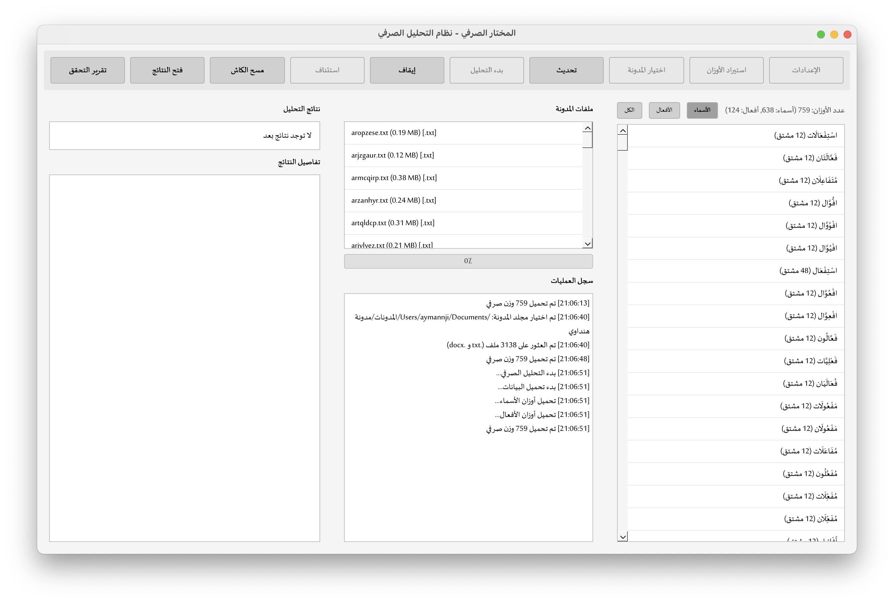
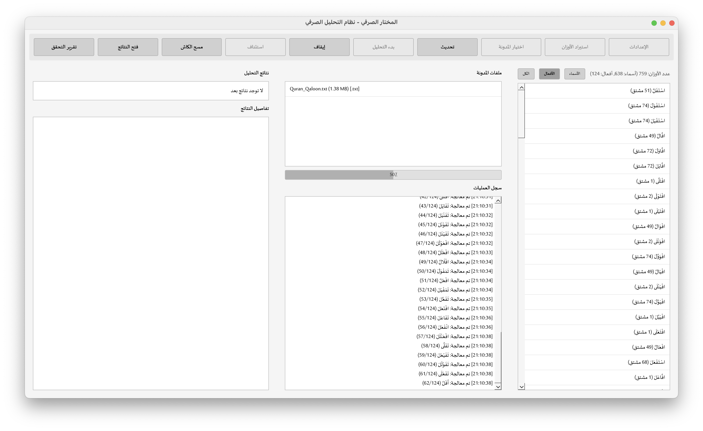
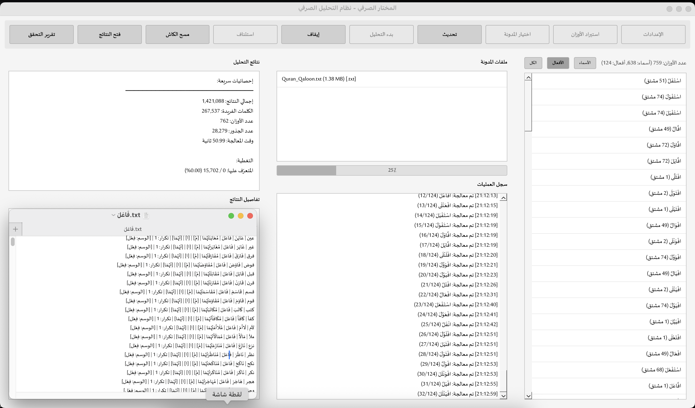

# المختار الصرفي

<div dir="rtl">

أداة متقدمة لتحليل الصرف العربي (Morphological Analysis) مع قاعدة بيانات شاملة للأوزان والوسوم والسوابق واللواحق.


</div>

## المميزات

- **تحليل صرفي شامل**: تحليل الأسماء والأفعال
- **قاعدة بيانات شاملة**: أوزان الأسماء والأفعال، السوابق واللواحق
- **نظام الوسم**: تصنيف الكلمات حسب نوعها
- **قلب الأوزان**: تحويل الأوزان بين الصيغ المختلفة
- **واجهة رسومية**: واجهة مستخدم سهلة الاستخدام
- **تقارير مفصلة**: تقارير تحليلية شاملة
- **نظام تخزين مؤقت**: تسريع التحليل المتكرر

## المتطلبات

- Python 3.7 أو أحدث
- PyQt6 (للواجهة الرسومية - إن وجدت)

## التثبيت

1. استنسخ المستودع:
```bash
git clone https://github.com/ayzem88/morphological-selector.git
cd morphological-selector
```

2. ثبت المتطلبات:
```bash
pip install -r requirements.txt
```

3. **ملاحظة مهمة**: البرنامج يحتاج ملف `morphology.db` (قاعدة البيانات الصرفية) للعمل. هذا الملف كبير جداً (>100MB) ولم يتم رفعه على GitHub.

   **الحلول**:
   - يمكنك إنشاء قاعدة البيانات من ملفات `قواعد البيانات/*.txt` الموجودة في المستودع
   - أو طلب الملف من المطور
   - البرنامج سيعمل بدون قاعدة البيانات لكن مع وظائف محدودة

## الاستخدام

### التشغيل

```bash
python run.py
```

أو مباشرة:
```bash
python "0.5 المختار الصرفي.py"
```

## الملفات

- `0.5 المختار الصرفي.py`: الملف الرئيسي
- `run.py`: ملف التشغيل المبسط
- `morphology.db`: قاعدة البيانات الصرفية
- `قواعد البيانات/`: مجلد قواعد البيانات النصية
  - `أوزان_الأسماء.txt`
  - `أوزان_الأفعال.txt`
  - `الوسم.txt`
  - `سوابق ولواحق_أسماء.txt`
  - `سوابق ولواحق_أفعال.txt`
  - `قلب الأوزان.txt`
  - `الخريطة.txt`
- `cache/`: مجلد التخزين المؤقت
- `reports/`: مجلد التقارير

## الميزات التفصيلية

### تحليل الأسماء
- تحديد وزن الاسم
- كشف السوابق واللواحق
- تصنيف حسب الوسم

### تحليل الأفعال
- تحديد وزن الفعل
- كشف السوابق واللواحق
- تصنيف حسب الوسم

### قلب الأوزان
- تحويل الأوزان بين الصيغ المختلفة
- دعم التحويلات المعقدة

## الاختبار

```bash
# تثبيت متطلبات التطوير
pip install -r requirements-dev.txt

# تشغيل الاختبارات
python -m pytest tests/
```

## المساهمة

نرحب بمساهماتكم! راجع [دليل المساهمة](CONTRIBUTING.md) للتفاصيل.

## الترخيص

هذا المشروع مرخص تحت [MIT License](LICENSE) - راجع ملف LICENSE للتفاصيل.

## المطور

تم تطوير هذا المشروع بواسطة [ayzem88](https://github.com/ayzem88)

## التواصل

للاستفسارات أو المساهمة، يمكنك التواصل معي عبر:
- البريد الإلكتروني: [aymen.nji@gmail.com](mailto:aymen.nji@gmail.com)

## التطوير المستقبلي

- [ ] واجهة رسومية محسّنة
- [ ] دعم المزيد من الأوزان
- [ ] تحسين دقة التحليل
- [ ] واجهة سطر الأوامر (CLI)
- [ ] API للاستخدام البرمجي

## الصور





